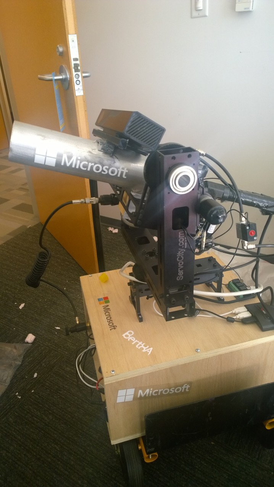
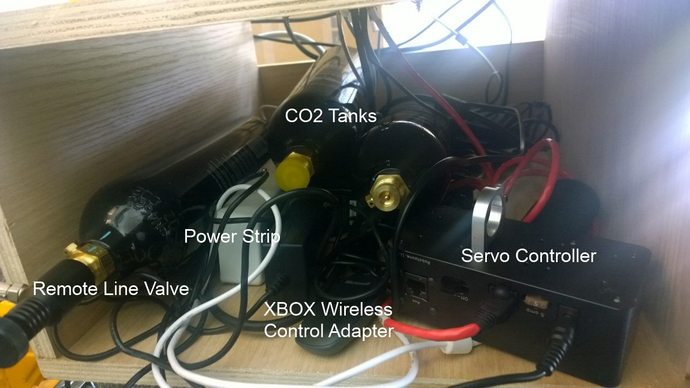
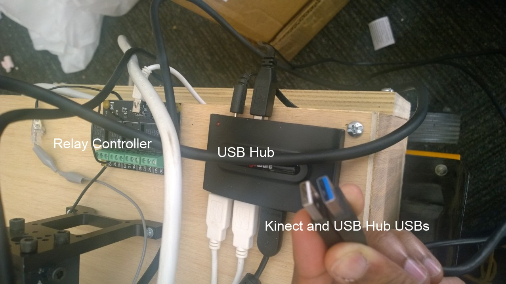
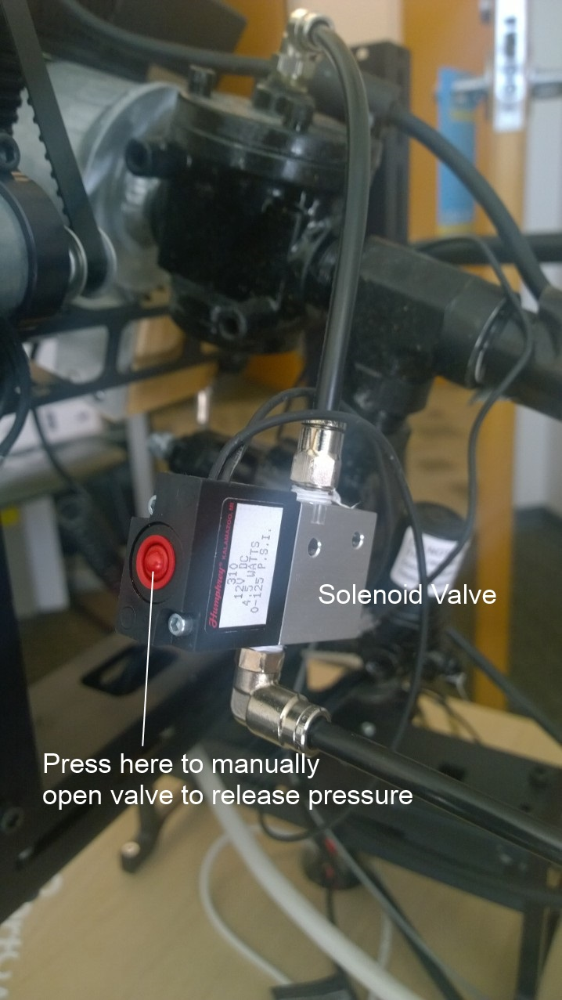
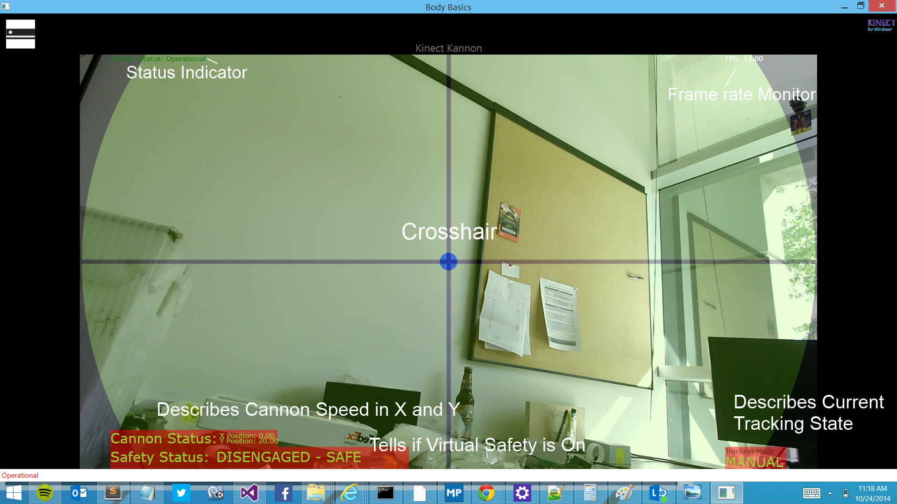
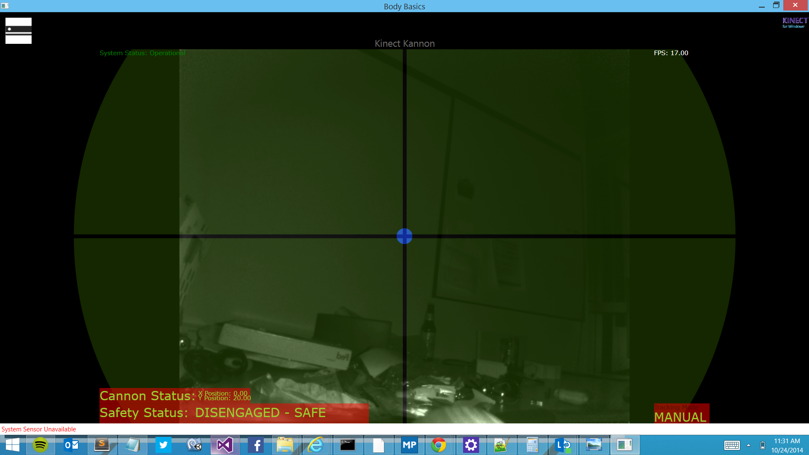

Inside KinectKannon - The Semi-autonomous Robotic T-Shirt Cannon
============
The [Kinect Kannon](http://stevenedouard.com/kinect-kannon-worlds-first-kinect-augmented-t-shirt-cannon/) is a semi-autonomous robotic T-Shirt that is augmented by [Kinect for Windows](http://www.microsoft.com/en-us/kinectforwindows/) which fires by opening a valve releasing approximatley 100 PSI of CO2.

# Video

Checkout the [Video demo](http://www.youtube.com/watch?v=hiz9NsTZHDk) of the KinectKannon.

# How its Made

The Kinect Kannon has been put together with mostly store-bought parts. The parts list includes:

- [AirCannons.com](http://aircannons.com/) T-Shirt Cannon
- Phidgets [USB Interface Relay Kit](http://www.phidgets.com/products.php?category=9&product_id=1014_2)
- Phigets [USB Advanced Servo Controller ](http://www.phidgets.com/products.php?category=11&product_id=1061_1)
- [ServoCity.com MPT2100 Pan and Tilt Module](http://www.servocity.com/html/mpt2100-ds_pan___tilt_system.html#.VEWh5yldV68)
- Hard Oak Plywood Box Hand Assembled
- [Kinect For Windows](http://www.microsoft.com/en-us/kinectforwindows/) and [Kinect for Windows SDK](http://www.microsoft.com/en-us/download/details.aspx?id=44561)

The TShirt Cannon is mounted to the Pan and Tilt control with a piece of 2 by 4 wood. This keeps the cannon attached firmly allowing for more precise control.

To secure the Pan/Tilt control, a wooden box was made from oak plywood. This provides a very sturdy base for the control as it will be shifting its center of gravity as the cannon is moved and aimed.

An empty space is provided in the box with a missing wall. Inside are a few things:

- Power Strip
- USB 8 Motor Servo Controller (to manipulate pan/tilt)
- USB Relay controller
- USB Hub (to reduce clutter)
- CO2 tank and hose
- XBOX 360 Wireless USB Adapter

The space allows us to easily tuck away all the wires required to run the cannon, making for easier operation.

2 Single USB cables, one for the Kinect (it requires USB3) and a USB hub for the relay, XBOX controller and servo controller interface to the laptop. With a single plug from a wall outlet to the powers trip within the box, the system comes alive.

## What's running on the computer? 

A WPF (Windows Presentation Foundation) desktop application is used with the Kinect SDK as well as some auxiliary libraries for the XBOX controller as well as the servo and relay controllers. The application is organized using a high level code behind file for the Main XAML window and a few singleton classes:

- PanTiltController - A singleton class which provides high level on/off and panning methods.
- FiringController - A singleton class which provides a 'virtual' safety as well as a high level firing method.
- Automator - A small class that handles controlling the PanTiltController based on audible or skeletal input.
- Renderer - A class that handles rendering the color, infrared and skeletal streams.
- HudRenderer - A class that handles rendering the Heads-up Display
- App - The main app file which controls high-level states of the application such as tracking mode and the state of the safety.

## Rational behind technology decisions

Like any other engineering project, we were under a tight timeline. We had approximately 4 weeks before we needed to showcase it at a large presentation. We chose the path of least resistance.

The Kinect SDK works only on Windows, although there is an [open source implementation](http://openkinect.org/wiki/Main_Page) that can be used on Mac OS X and Linux. The SDK works out of the box seamlessly with the Kinect and already has very nice wrappers for C#. We decided to use the SDK as it provided samples in C# for skeletal, audio and color frame rendering. It made things way faster by simply taking the code examples and organizing them into a larger application.

Why WPF and not a modern Windows 8 App? .NET and Windows APIs have a different surface area for the Windows 8 app environment. In this environment not all APIs available on the desktop are accessible. Although the [Kinect SDK v2.0 supports Windows 8 apps](https://games.yahoo.com/news/microsoft-releases-final-kinect-sdk-155534346.html), the drivers for the servo controller, relay controller and possibly the open source library for the XBOX controller had dependencies on legacy desktop APIs. We also have no intention of publishing the app on the store because the Kinect Kannon is quite expensive!

## How to Operate KinectKannon

The Kinect Kannon is easy to operate but requires a few key pieces of knowledge and warnings.

### Warning 

#### CO2 Tank
The CO2 tank when full can contain up to 3000 PSI of gas. This is a very dangerous amount of pressure when mishandled. Here are a few tips to keep you and everyone safe:

- When flying with the CO2 tanks, TSA regulations require the tanks be emptied AND the valve unscrewed. Refer to the paintball tank labeling for this.
- When shipping federal regulations require that the CO2 tanks are emptied.
- Do NOT leave the CO2 tank in your car as the heat may cause it to explode.
- When attaching and detaching the CO2 tank ensure that you are not unscrewing the valve as this can be deadly.
- When moving Kinect Kannon, close the CO2 tank valve on the remote line and release and remaining pressure in the cannon by pressing the red button on the electronic valve (pictured below).
- Always fill it up at a paintball store like [Sports Authority](http://sportsauthority.com)

#### No Range Stops

The Kinect Kannon Pan/Tilt does not return a position to the main application. Therefore Kinect Kannon does not know its position and its up to you to ensure that it does not turn too far left or right, which can **RIP OUT CORDS AND CAUSE TERRIBLE DAMAGE**. Please be sure to keep an eye on the controller and if the cannon gets out of control for any reason (computer freezes, program crashes etc.) **KILL THE POWER TO KINECT KANNON**.

### Getting Setup

Ensure that you have a **fast** **dedicated** machine to use. You need an i7 Surface Pro 3, Lenovo X1 Carbon or faster.]

Install the following:

- [Kinect for Windows SDK]http://www.microsoft.com/en-us/download/details.aspx?id=44561)
- [Phidgets USB .NET Libraries and Drivers](http://www.phidgets.com/docs/OS_-_Windows)
- [Visual Studio/VS Express 2013](http://www.visualstudio.com/downloads/download-visual-studio-vs) (or newer)

### Running Kinect Kannon

Clone this repository and open the solution file.

Ensure that Kinect Kannon is powered on by plugging in the powers trip to a wall power outlet. Plugin the Kinect USB cable and the USB hub cable to the laptop. Ensure that at least the Kinect USB cable is plugged into a USB 3.0 (blue) port.

Press F5 to run the application, it will say 'Kinect Kannon Fully Initialized'. The Kinect Kannon camera should render on the screen with cross hairs and on the top left the **System Status** should read **Operational**. 

To pair an XBOX 360 controller to the cannon, press the wireless pairing button on top of your controller (not the XBOX button) and press the pairing button on the wireless adapter. After a few  seconds it should kinect and you are ready to operate Kinect Kannon.

### Operating Kinect Kannon

When you start up the Kinect Kannon you will be presented with the Camera (Color Stream) and Heads Up Display (HUD).

Kinect Kannon has 3 operational modes:

- Manual Mode
- Skeletal Tracking Mode
- Audible Trackign Mode

#### Manual Mode

In manual mode you can control Kinect Kannon on the X and Y axis by moving the left analog stick. This mode is the default mode of Kinect Kannon and can be reached by pressing **X** on the XBOX control.

#### Skeletal Mode

In skeletal mode, you cannon control the Kinect Kannon in either the X or Y direction. The Kannon will move to track any detected skeletons in its view. To change the targeted skeleton press **Left** and **Right** on the directional pad (this only works if there is > 1 skeleton on the screen). Press **A** on the XBOX control to get to this mode.

#### Audible Mode

Audible mode prevents you from controlling Kinect Kannon in the X direction but you can control it in the Y direction. Kinect Kannon will autonomously pan left and right depending on point sounds it recognizes from its directional microphone. Press **B** on the XBOX control to get to this mode.

#### Night vision

The Kinect is equipped with an infrared sensor and therefore can see at night. Press **Y** on the controller to activate night vision mode. This doesn't change any functionality of Kinect Kannon - skeletal and audible tracking work the same.

The video window will be a bit smaller because Kinect's infrared resolution is smaller than its camera.

#### Firing the Kinect Kannon

In all modes you can control the firing and for safety reasons, Kinect Kannon will **NEVER** fire on its own.

To fire the control follow these steps:

1. Ensure that the Kinect Kannon is loaded with a rolled, rubberbanded T-Shirt
2. Ensure that the CO2 tank is attached to the remote line and that the remote line valve is open.
3. On your XBOX controller, press the left and right triggers simultaneously. This deactivates the safety and Kinect Kannon will say 'System Armed. Pull Both Triggers Simultaneously to Fire'. The **Safety Status** on the HUD will say 'ENGAGED - READY TO FIRE'.
4. Ensure that nobody is directly in front of the Kinect Kannon and do not aim it directly at anyone. Pull both left and right triggers and with a loud noise, the T-Shirt should be launched!

